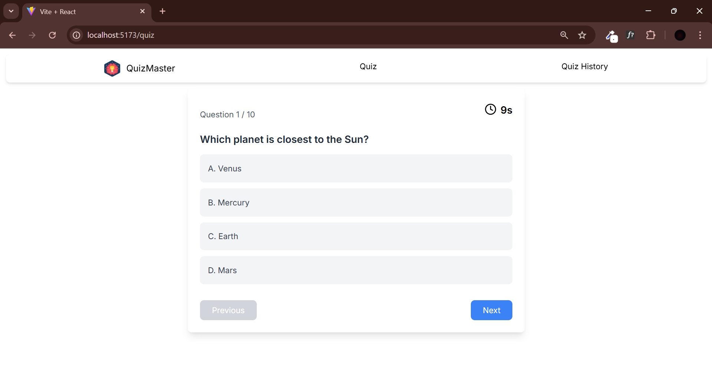
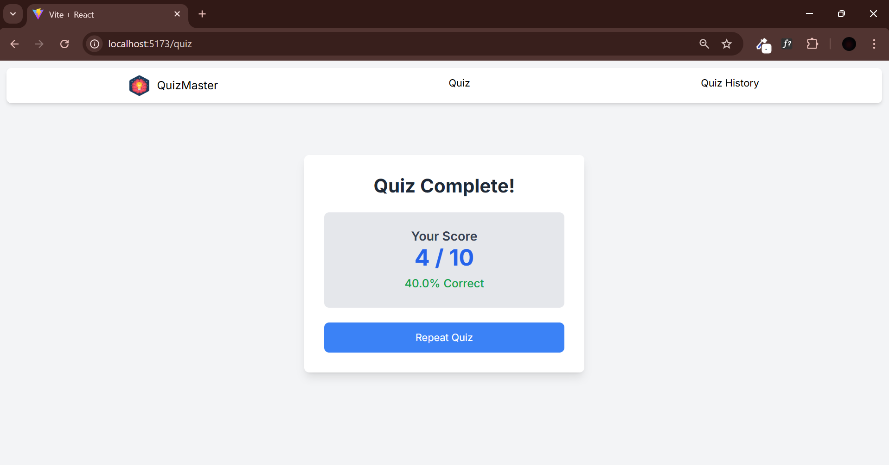
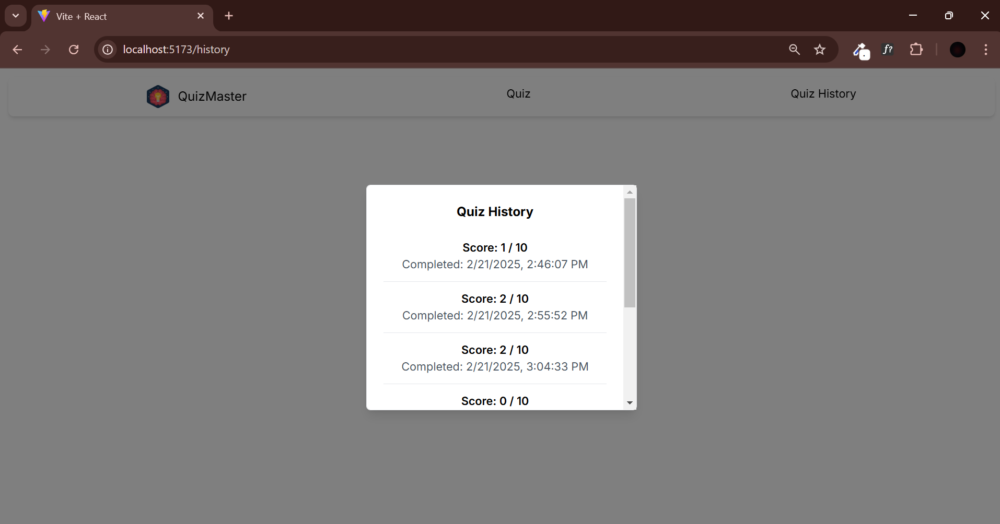

# QuizMaster

A simple quiz application built with React.
https://quize-master-app.netlify.app/

## Features

- Multiple-choice and integer-based questions
- Timer for each question
- Quiz history stored in IndexedDB
- Score calculation and result display
## Screenshot




## Installation

1. Clone the repository:
   ```sh
   git clone https://github.com/rohitrathod2023/Quize-Master-app.git


